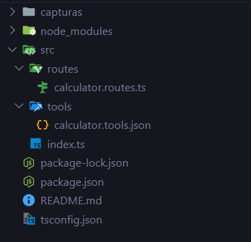
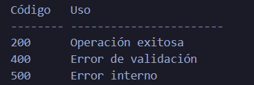
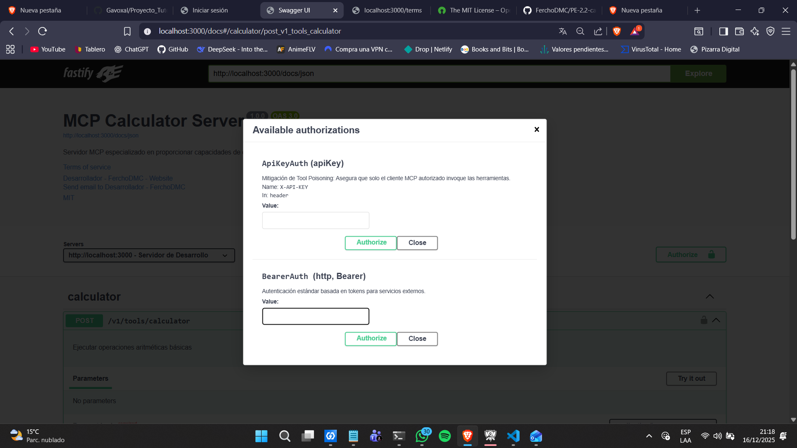
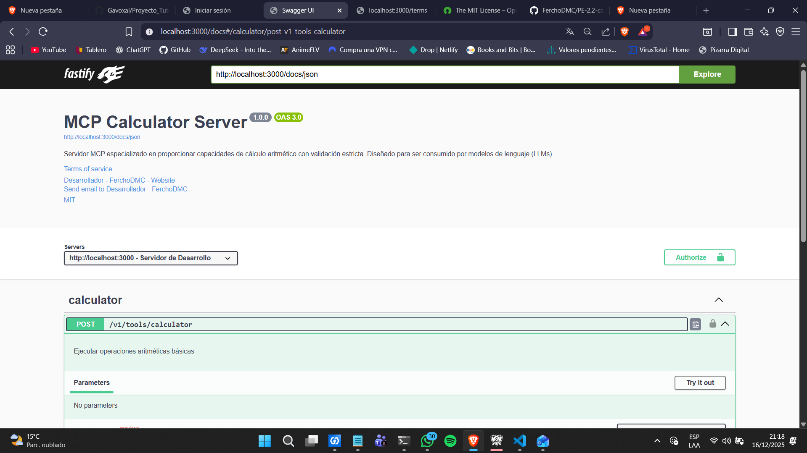
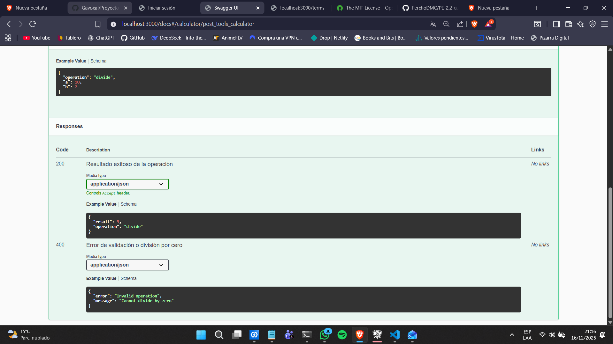
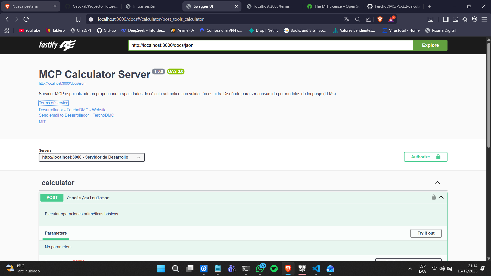

# 🧮 Tool "Calculator" – Proyecto Fastify + TypeScript

Este proyecto implementa un **servidor de herramientas de cálculo** basado en Fastify y TypeScript. Ha sido refinado para cumplir con los estándares de OpenAPI 3.0, incluyendo metadata detallada, esquemas de seguridad y ejemplos de casos de uso para facilitar su integración con Model Context Protocol (MCP).

## 🚀 1. Configuración del Proyecto

### Requerimientos previos
- Node.js 
- npm 
- Extensiones: Thunder Client / Swagger UI

### Inicializacion del proyecto
- npm init -y

### Dependencias
- npm install fastify
- npm install @fastify/swagger
- npm install @fastify/swagger-ui

### Dependencias de desarrollo
- npm install -D @types/node nodemon ts-node typescript

## 📁 2. Estructura del Proyecto

## ⚠️ 3. Manejo Centralizado de Errores

## 🧐 4.Seguridad Documentada

En esta fase, la seguridad se implmento a nivel de documentación y contrato OpenAPI, aunque no esta activa en la lógica del servidor de desarrollo:

**¿Qué se definió?:**

Se configuraron los esquemas de API Keys (X-API-KEY) y Bearer Tokens dentro de los componentes de Swagger.
El objetivo es dejar listo el contrato para que cualquier cliente sepa que en un entorno de producción, debe proveer credenciales para operar.

**Mitigación de Tool Poisoning:**

Al documentar estos requisitos, se establece la base para prevenir que atacantes engañen a la IA para ejecutar comandos maliciosos, asegurando que solo usuarios con una llave válida puedan usar la calculadora en el futuro.

## 📈 5. Versionado y Evolución del API

Para que el proyecto sea profesional y no se rompa al hacer cambios, apliqué estas estrategias:

**Versionado Semántico (SemVer):**
El proyecto está configurado en la versión 1.0.0 dentro de la metadata del API.

**Estrategia por URL:**
Se eligió documentar la ruta bajo */v1/tools/calculator*, lo cual permite que la IA identifique versiones explícitas sin necesidad de revisar cabeceras.

**Ley de Postel (Principio de Robustez):**
Mi implementación es flexible; el servidor procesa la petición incluso si recibe datos extra no esperados, pero siempre responde con un formato de salida estricto y predecible.

## 💭 6. Ejemplo OpenAPI

## Validacion del servidor corriendo
