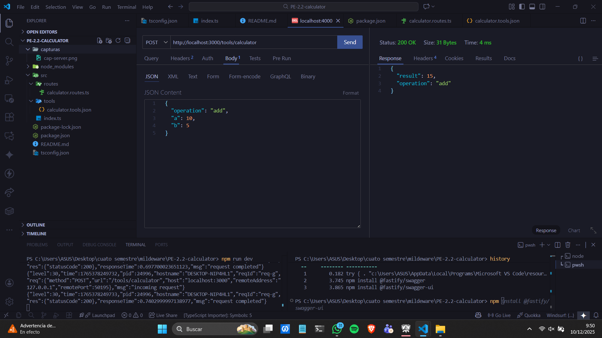
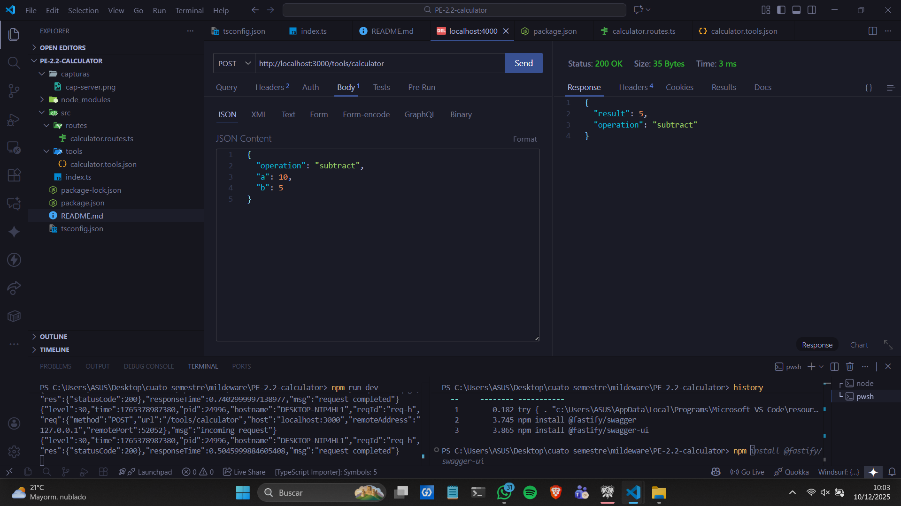
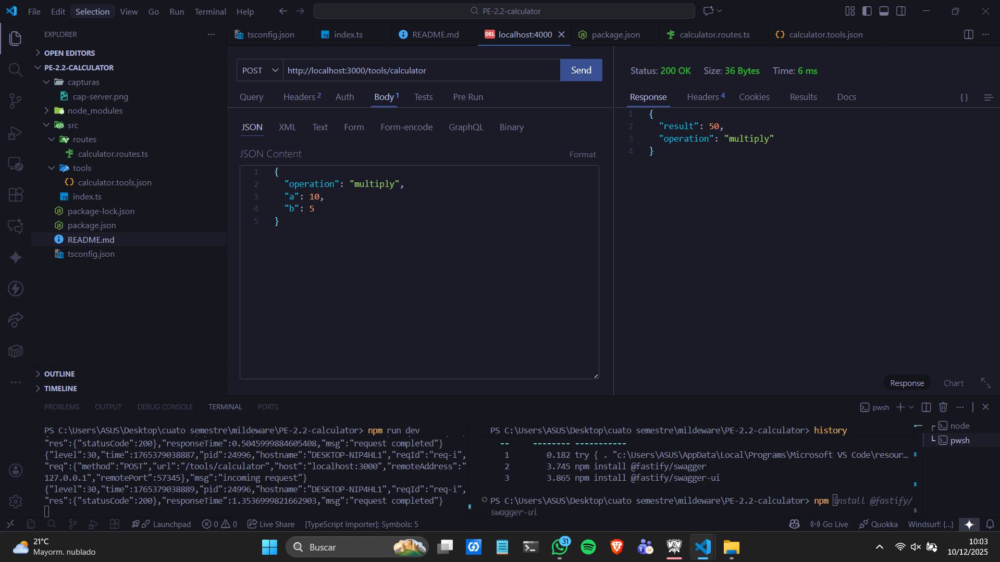
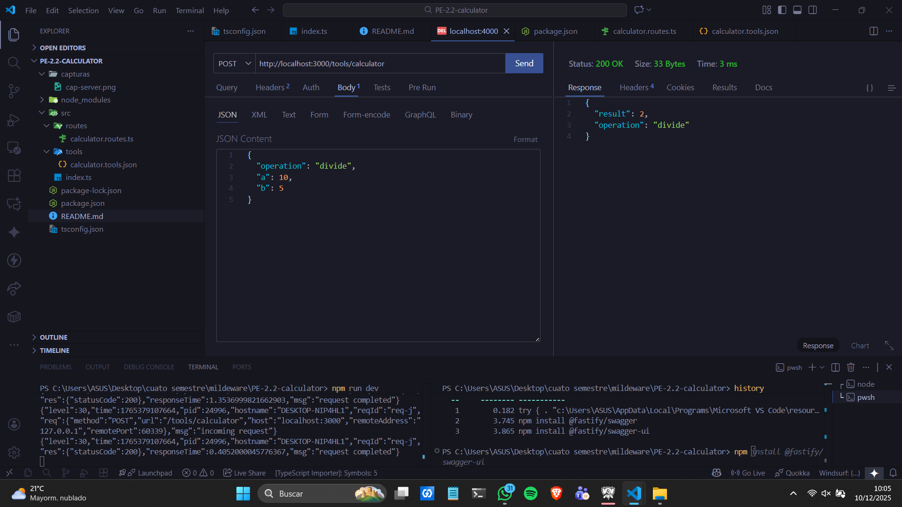
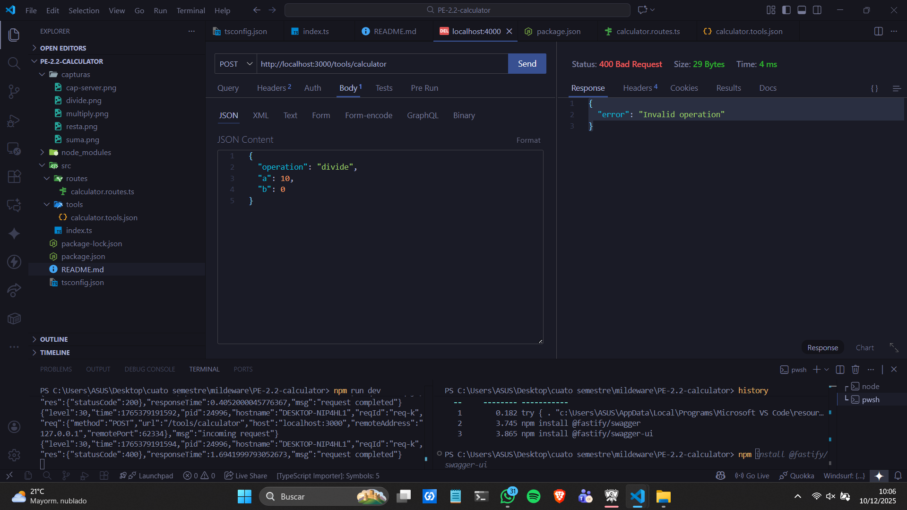
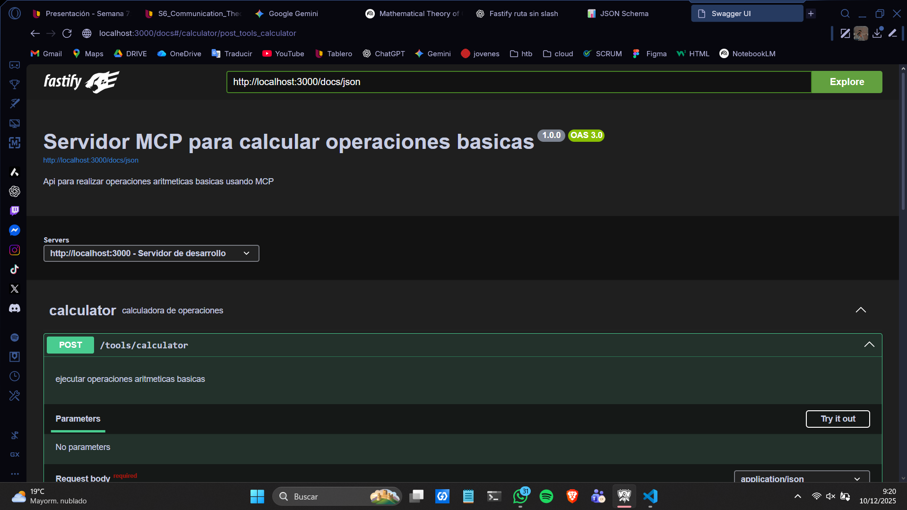

# 🧮 Tool "Calculator" – Proyecto Fastify + TypeScript

Este proyecto implementa un **tool de cálculo** expuesto vía API sobre Fastify, con validación estricta mediante JSON Schema y documentación OpenAPI generada automáticamente. El objetivo es entregar un endpoint robusto, escalable y alineado a buenas prácticas de desarrollo backend.

## 🚀 1. Configuración del Proyecto

### Requerimientos previos
- Node.js 
- npm 
- Thunder Client 

### Inicializacion del proyecto
- npm init -y

### Dependencias
- npm install fastify
- npm install @fastify/swagger
- npm install @fastify/swagger-ui

### Dependencias de desarrollo
- npm install -D @types/node nodemon ts-node typescript

## 📁 2. Estructura del Proyecto
.
├─ capturas/
├─ node_modules/
├─ src/
│  ├─ routes/
│  │  └─ calculator.routes.ts
│  ├─ tools/
│  │  └─ calculator.tools.json
│  └─ index.ts
├─ package.json
├─ package-lock.json
├─ README.md
└─ tsconfig.json

## ⚠️ 3. Manejo Centralizado de Errores

  Código   Uso
  -------- -----------------------
  200      Operación exitosa
  400      Error de validación
  500      Error interno

## 🧐 4.Ejemplos de validacion en Thunder

## Validacion de SUMA
### JSON content
{
  "operation": "add", 
  "a": 10, 
  "b": 5
}
### Response
{
  "result": 15,
  "operation": "add"
}
### Captura de Pantalla

## Validacion de resta
### JSON content
{
  "operation": "subtract", 
  "a": 10, 
  "b": 5
}
### Response
{
  "result": 5,
  "operation": "subtract"
}
### Captura de Pantalla

## Validacion de multiplicacion
### JSON content
{
  "operation": "multiply", 
  "a": 10, 
  "b": 5
}
### Response
{
  "result": 50,
  "operation": "multiply"
}
### Captura de Pantalla

## Validacion de division
### JSON content
{
  "operation": "divide", 
  "a": 10, 
  "b": 5
}
### Response
{
  "result": 2,
  "operation": "divide"
}
### Captura de Pantalla

## Validacion de division por 0
### JSON content
{
  "operation": "divide", 
  "a": 10, 
  "b": 0
}
### Response
{
  "error": "Invalid operation"
}
### Captura de Pantalla

## Validacion del servidor corriendo

